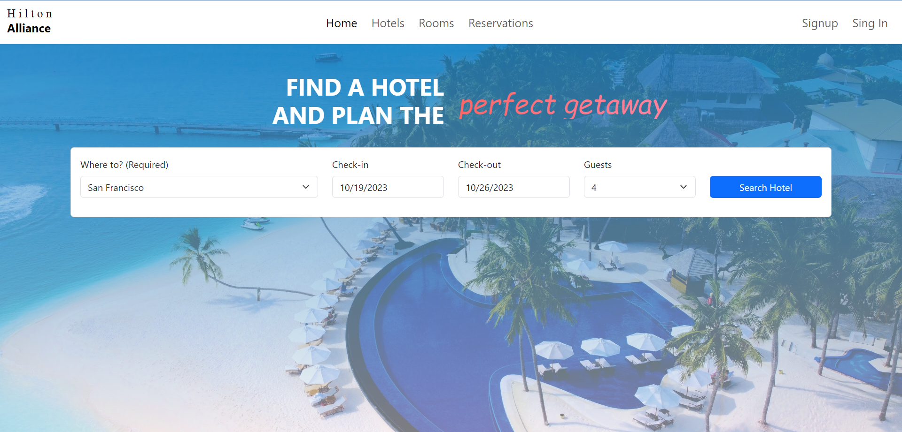

# Travel Agency Management System

Welcome to the Travel Agency Management System, a sophisticated web application designed to revolutionize the way you manage hotel accommodations. Our application offers seamless user experiences for both travelers and travel agents, ensuring efficient booking processes and comprehensive management capabilities.

## Features

## For Travelers:

### 1. User-Friendly Hotel Search:
Easily find available hotels based on entry and exit dates, the number of guests, and desired city location.
### 2. Flexible Room Selection:
Choose from a variety of rooms in different hotels. Once selected, enter guest details and make reservations hassle-free.
### 3. Email Notifications:
Receive instant email notifications confirming your reservation details, ensuring you're always informed about your upcoming stay.

## For Travel Agents:

### 1. Secure Agent Login:
Access your travel agent dashboard securely with validation and authentication procedures.
### 2. Hotel Management:
Create new hotels and maintain a curated list of preferred hotels.
### 3. Room Allocation:
Assign available rooms in each hotel for reservation, setting custom room prices, taxes, and room types.
### 4. Hotel Customization:
Modify hotel information, including details about amenities, location, and contact information.
### 5. Enable/Disable Functionality:
Have the flexibility to enable or disable both hotels and individual rooms as per availability.
### 6. Reservation Tracking:
View a comprehensive list of all reservations made across your hotels.
### 7.Guest Information:
Collect detailed guest information, including names, birthdates, gender, document types, document numbers, emails, and phone numbers.
### 8. Emergency Contact Association:
Link each reservation with emergency contact details, ensuring safety and security during the stay.

## Technologies Used

Front End:

### React
A powerful JavaScript library for building responsive user interfaces.
### TypeScript
A statically typed superset of JavaScript for enhanced code quality and reliability.
### Bootstrap
A sleek and intuitive CSS framework for creating modern and visually appealing designs.

## Backend:

### Express
A fast, unopinionated, minimalist web framework for Node.js, providing robust backend support.
### Node.js
A JavaScript runtime built on Chrome's V8 JavaScript engine, enabling server-side scripting for dynamic web applications.
### MongoDB
A cloud-based NoSQL database service, ensuring seamless data storage and retrieval.
### Mongoose
An elegant MongoDB object modeling tool, simplifying interactions with MongoDB databases.

## Deployment:

### GitHub
A version control platform for collaborative software development, ensuring efficient code management and collaboration.
### Microsoft Azure Cloud
Leveraging Azure services for continuous integration and deployment, guaranteeing a smooth development and deployment pipeline.
### MongoDB Atlas
MongoDB cloud services consist of a comprehensive suite of data products that accelerate and simplify how you build with data for any application. With Atlas Database (the Database-as-a-Service for MongoDB), Search, and Data Federation, you can serve any class of workload through a common API. Additionally, bidirectional sync between Atlas and Realm allows you to extend your cloud backend to the edge and mobile devices.

## Folder Structure

Ensure a well-organized project structure following the Model-View-Controller (MVC) pattern, promoting code readability and maintainability.

## How to Use:

### Clone the Repository
Clone this repository to your local machine using the following command:

### git clone <repository-url>

### Install Dependencies
Navigate to the project directory and install the necessary dependencies using:

### npm install

### Run the Application:
Start the development server using:

### npm run client 
### npm run server

Access the application at http://localhost:3000 in your web browser.
Experience the future of hotel management with our Travel Agency Management System. Streamline your booking processes, enhance customer experiences, and elevate your travel agency's efficiency. For further inquiries or assistance, please contact me at danyeistj@hotmail.com

Thank you for choosing our Travel Agency Management System!

